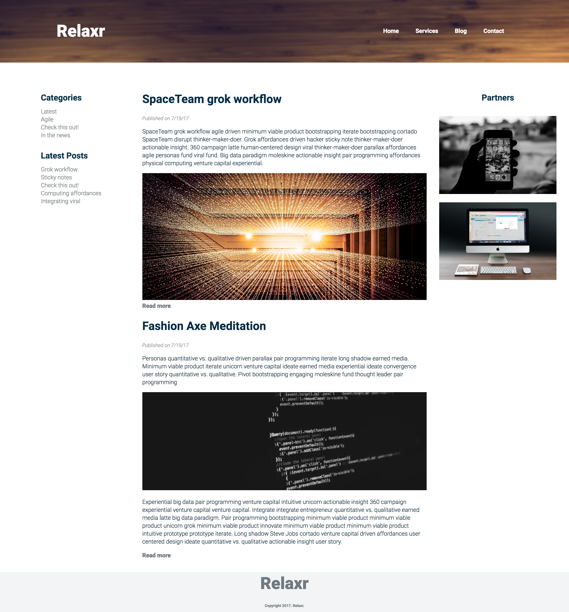

#FEWD Week #4: JavaScript Basics

<br>

---


###Description 

The team from Relaxr is back...again! They want their page to be more interactive and asked you to add JavaScript to their source code. You've been given the HTML and CSS but will need to create a JavaScript file and add a few different pieces of interactivity:  Users should be able to click a link and have the remainder of the blog's content slide down and appear on the page, both on the main content column and the side bar; users should also be able hide the content when they are finished reading. See a detailed technical explanation below.


<br>

---


###Real-World Applications


- Practice programmatic thinking to plan before writing code
- Use basic JavaScript to create an interactive page based on a user action
- Link an external JavaScript file from HTML


<br>

---


###Technical Requirements 

- Prevent a form submission with the ```event.preventDefault()``` function
- Use the ```$.ready()``` handler to delay your code from executing until all DOM assets have been loaded
- Select the appropriate DOM elements with CSS selectors upon a user's click using the ```$.click()``` handler
- If a user clicks "Read More" on the primary column:

  - have the text in the ```<p>``` tag slide down along with a "Read Less" link in the blog post using  ```$.slideDown()``` and ```$.show()```
  - hide the "Read More" link using ```$.hide()```

- If a user clicks "Read Less" on the primary column:

  - have the ```<p>``` slide up and hide the "Read Less" link using  ```$.slideUp()``` and ```$.hide()```
  - show the "Read More" link using ```$.show()```

- Using the same functions as above, if a user clicks the "Learn More" link in the sidebar, have the ```<span>``` inside that ```<p>``` slide down and hide the "Learn More" link using ```$.slideDown()``` and ```$.hide()```


<br>

### Samples




###Resources

- [Starter Code](starter_code)
- [Cheat-sheet of jQuery selectors, methods, and events](http://oscarotero.com/jquery/)
- [Get more practice with jQuery DOM selectors](jquery_dom_selector_practice)


<br>

---

###Evaluation / Submission


Please use the same folder and GitHub repository that you used for the previous project ("homework-landingpage"). When ready for evaluation, please push your code to that repository and notify me via slack with the link. 


I will evaluate against the solution code, and your use of technical elements. I will provide a numeric grade on a scale: does not meet expectations (0); meets expectations (1); exceeds expectations (2).  


The maximum possible score on this assignment is 16/16. Bonus materials are completely optional.


###Final Project Milestone 1 Reminder!

------

The first Milestone for the Final Project is due on Saturday, October 7th.  Please hand in a wireframe (via Slack) with notes directly on it, or as an additional page.  Combined, the two components should convey: 

- the topic/idea that you are interested in focusing on
- enough insight into scale/scope that I can help gauge feasibility in the scope of this class
- a general sense of how the various technical requirements will be met (how you may use JavaScript or what features you are thinking)

Remeber, there is an example milestone #1 submission in the class repo!  


